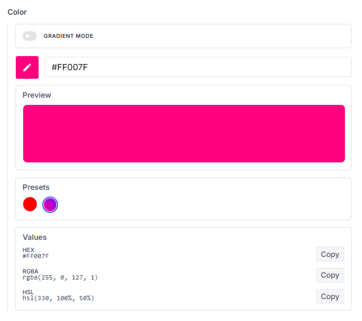
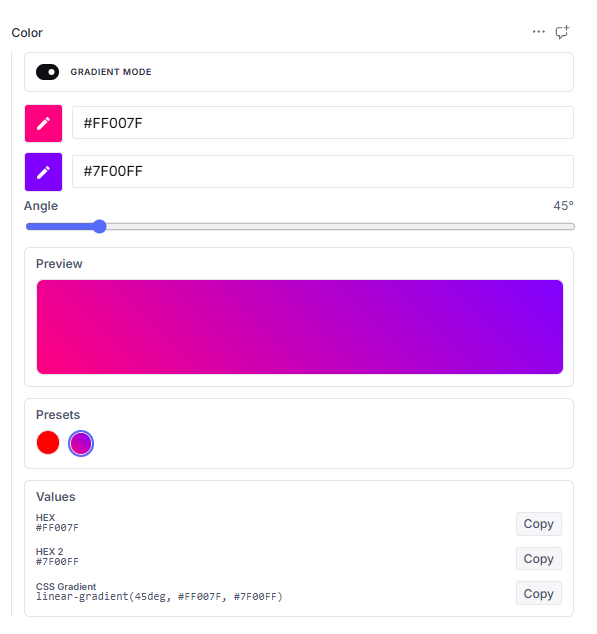

# Sanity Plugin Color Input

A beautifully designed, premium, and highly customizable color picker plugin for **Sanity Studio v3, v4, v5, and v6**.
Supports solid colors and linear gradients.

## Documentation

For full setup guides, configuration options, visit our [In-depth Documentation](https://code-journey-package-guides.vercel.app/sanity-plugin-color-input).

<p align="center">
  
  
</p>

---

## Key Features

- **Visual Color Picker**: A sleek, modern user interface for precise color selection.
- **Dual Modes**: Seamlessly toggle between solid colors and gorgeous, linear gradients.
- **Rich Format Outputs**: Computes and displays `HEX`, `RGBA`, and `HSL` formats, plus full CSS `linear-gradient` strings for gradients.
- **One-Click Clipboard**: Instant copying of any color format to your clipboard.
- **Branded Presets**: Choose between our built-in curated presets or supply custom, brand-specific color arrays.
- **Studio Optimized**: Fully integrated with Sanity Studio's design tokens and responsive layout system.

---

## Installation

Install the package using your preferred package manager:

```bash
# Using npm
npm install sanity-plugin-color-input

# Using yarn
yarn add sanity-plugin-color-input

# Using pnpm
pnpm add sanity-plugin-color-input
```

---

## Configuration & Setup

> [!NOTE]  
> Compatible with **Node.js 22, 24, and 26**.

Initialize the plugin within your `sanity.config.ts` (or `sanity.config.js`) file:

```typescript
import {defineConfig} from 'sanity'
import {customColorPicker} from 'sanity-plugin-color-input'

export default defineConfig({
  plugins: [customColorPicker()],
})
```

OR

```typescript
import {defineConfig} from 'sanity'
import {customColorPicker} from 'sanity-plugin-color-input'

export default defineConfig({
  plugins: [
    customColorPicker({
      disablePresets: false,
      disableCopyValues: false,
      colors: [
        // Solid colors
        '#FF0000',
        '#00FF00',
        '#0000FF',
        '#FFFF00',
        // Gradient colors
        {hex: '#FF007F', hex2: '#7F00FF', angle: 45},
        {hex: '#00F2FE', hex2: '#4FACFE', angle: 180},
      ],
    }),
  ],
})
```

---

## Schema Configuration

Once initialized, the custom `color` schema type becomes globally available in your schema configurations.

### Basic Usage

Add the `color` type directly into your document schemas:

```typescript
export default {
  name: 'project',
  title: 'Project',
  type: 'document',
  fields: [
    {
      name: 'accentColor',
      title: 'Accent Color',
      type: 'color',
    },
  ],
}
```

### Default Color Presets

By default, the picker provides a curated array of professional preset solid and gradient colors:

- **Solid Colors**:
  - `Red`: `#f44336`
  - `Pink`: `#e91e63`
- **Linear Gradients**:
  - `Warm Sunset`: `#ff9a9e` to `#fad0c4` (at `90°`)
  - `Spring Meadow`: `#84fab0` to `#8fd3f4` (at `45°`)

### Providing Branded Color Presets

To lock the color palette to your brand specifications, override the default presets by providing a `colors` list inside the field `options`:

```typescript
export default {
  name: 'project',
  title: 'Project',
  type: 'document',
  fields: [
    {
      name: 'accentColor',
      title: 'Accent Color',
      type: 'color',
      options: {
        colors: ['#1A1A1A', '#F5F5F5', {hex: '#E91E63', hex2: '#2196F3', angle: 45}],
      },
    },
  ],
}
```

### Hiding Presets and Copy Values

You can disable the presets section or the copy value outputs section either globally via the plugin configuration, or individually on a per-field basis:

```typescript
export default {
  name: 'project',
  title: 'Project',
  type: 'document',
  fields: [
    {
      name: 'accentColor',
      title: 'Accent Color',
      type: 'color',
      options: {
        disablePresets: true,
        disableCopyValues: true,
      },
    },
  ],
}
```

---

## Return Data Structure

The returned database schema adapts dynamically to the selected mode:

```json
{
  "_type": "color",
  "hex": "#f44336",
  "rgba": "rgba(244, 67, 54, 1)",
  "hsl": "hsl(4, 90%, 58%)",
  "isGradient": true,
  "hex2": "#000000",
  "angle": 180,
  "css": "linear-gradient(180deg, #f44336, #000000)"
}
```

---

## Rich Text / Portable Text Highlight Integration

To use the custom color picker inside Portable Text (Rich Text) highlight annotations, define a mark annotation inside your portable text array configuration:

```typescript
export default {
  name: 'richText',
  title: 'Rich Text',
  type: 'array',
  of: [
    {
      type: 'block',
      marks: {
        annotations: [
          {
            name: 'highlight',
            type: 'object',
            title: 'Highlight Annotation',
            fields: [
              {
                name: 'color',
                type: 'color',
                title: 'Text Color',
              },
            ],
          },
        ],
      },
    },
  ],
}
```

### Stored Rich Text Payload Example

```json
{
  "_key": "2ef685a16342",
  "_type": "block",
  "children": [
    {
      "_key": "4b929316bf10",
      "_type": "span",
      "marks": ["f9bfae1005c4"],
      "text": "Learning Platform"
    }
  ],
  "markDefs": [
    {
      "_key": "f9bfae1005c4",
      "_type": "highlight",
      "color": {
        "_type": "color",
        "hex": "#cddc39",
        "hsl": "hsl(66, 70%, 54%)",
        "isGradient": false,
        "rgba": "rgba(205, 220, 57, 1)"
      }
    }
  ]
}
```

---

## ⚖️ License

MIT License © Code-Journey. All rights reserved.

Licensed under the MIT License. You may obtain a copy of the License at [LICENSE](LICENSE).

---

## ⭐ Support & Feedback

If you find this plugin helpful, intuitive, or visually stunning, please consider leaving a star on our repository! Your appreciation helps keep us motivated to design, update, and maintain premium developer tools.

- 👉 **[Star the Repository on GitHub](https://github.com/Code-Journey-77/sanity-plugin-color-input)**
- 🔗 **[Sanity Plugin Marketplace Listing](https://www.sanity.io/plugins/sanity-plugin-color-input)**
